## Ray tracing render project

This is the third homework of the computer graphics course. In this project, I will render the model by backward ray tracing. The input is a group of geometries, and the output is the rendering image. There are two modes:

1. point light source: 

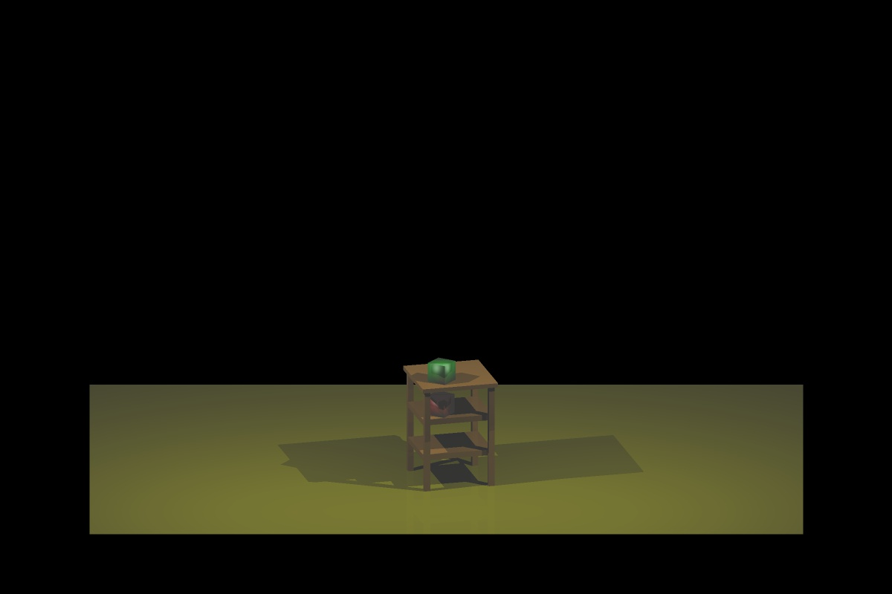

You can have 3 types of geometries:

- sphere
  - position (3 floats)
  - radius (1 float)
  - diffuse color (3 floats)
  - specular color (3 floats)
  - shininess (1 float)
- triangle
  - repeated three times (once for every vertex)
    - position (3 floats)
    - normal (3 floats)
    - diffuse color (3 floats)
    - specular color (3 floats)
    - shininess (1 float)
- light
  - position (3 floats)
  - color (3 floats)

2. area light source:

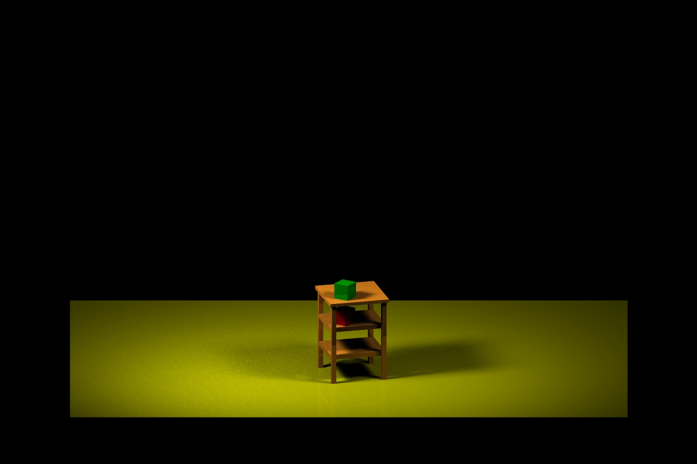

You also can have 3 types of geometries, but the attribute of each geometry are slightly different:

- sphere
  - position (3 floats)
  - radius (1 float)
  - diffuse color (3 floats)
  - roughness (1 floats)
  - metal (1 float)
- triangle
  - repeated three times (once for every vertex)
    - position (3 floats)
    - normal (3 floats)
    - diffuse color (3 floats)
    - roughness (1 floats)
    - metal (1 float)
- light
  - repeated four times (once for every vertex of the area light)
    - vertex position (3 floats)
  - centroid position (3 floats)
  - normal (3 floats)
  - color (3 floats)


Environment for this project:

- Windows OS

- visual studio 2017 or higher version

External library:

- GLUT: create the window
- GLEW: for OpenGL
- GLM: OpenGL Mathematics  library
- jpeg: for save the output image

Features of this project:

- Render the scene by backward ray tracing.
- Use Phone shading to determine the pixel color
- Recursive reflection
- Super sampling anti-aliasing (SSAA)
- Soft shadows with Monte-Carlo sampling and BRDF calculation
- Construct bounding volume hierarchy (BVH) with hybrid space partition (include surface area heuristic (SAH)). Use linear tree structure to speed up the searching process.
- Use multithread to fully utilize CPU resource when building BVH and doing ray tracing.  


How to use?

1. Click RayTracingRender.sln to run the project
2. The demonstration folder show the rendering image
3. The release folder has the compiled version of the project. You need to provide 2 or 3 extra parameters:

- The file path of the scene model
- The output image path
- Rendering mode (optional):
  - phong: use point light source and Phong model to render
  - brdf: use are light source and BRDF to render

4. The Bin folder contain the output of visual studio. Mind that this program need glew32.dll and freeglut.dll, so you need to put this two files into the folder that contain output the exe file.

5. The main.cpp file will tell you more specific setting of the parameters.


---

Technical details:

### 1. multithread execution function.

Since creating and destroying thread have overhead, so, when synchronization is not needed like the http server, it is better to use thread pool. But here in OpenGL, we need to synchronize everything. We cannot move ahead unless all the jobs are finished. Therefore, it is better to creating thread and then use join function to synchronize, and the overhead of creating and destroying thread is inevitable.

My implementation of multithread function is simple, the function is in the parallel.cpp file.

```c++
void parallelRun(const std::function<void(long long unsigned int)>& func,
const long long unsigned int length, const int nThreads = std::thread::hardware_concurrency() - 1) {
	std::vector<std::thread> threads_list;
	for (int thread = 0; thread < nThreads; thread++) {
		std::function<void(int)> warper = [&](int start) {
			for (long long unsigned int i = start; i < size; i += nThreads)
				func(i);
		};
		threads_list.push_back(std::thread(warpper, thread));
	}
	for (int thread = 0; thread < nThreads; thread++) {
		threads_list[thread].join();
	}
}
```

The input is a function that needs to be executed in parallel, and length is the total number of job id. First create a warper function and allocate the jobs, then run the warper function, and finally use join to synchronize.

It is also easy to use this function, the following example show how to output from 0 to 99 in parallel.

```c++
parallelRun([&](int i) {
    std::cout << i << std::endl;
}, 100);
```

Since ray tracing is an embarrassingly parallel problem, we can use the parallel run function to render the pixel independently, and it is thread safe. For more information about how I use this function to plot, you can read draw_scene() function in plot.cpp file.  

### 2. Recursive reflection and the attenuation factor.

In the Phong shading part (light source is a 0-dimensional point), if no reflection, then the image looks like:


In the figure below, if no reflection, then we only need to calculate the Phong shading of triangle 1, and let’s suppose the color is [0, 255, 0], which is green. However, when considering the reflection, we find that the reflection ray intersects with triangle 2. Then, I will calculate the Phong shading of triangle 2, and the color is [255, 0, 0], which is red. Now, I will suppose that triangle 2 is a ray source, and can emit light to triangle 1, and the color of the light is red. So, the final color received by triangle 1 would be the overlap of the two color: [0, 255, 0] + [255, 0, 0] = [255, 255, 0].

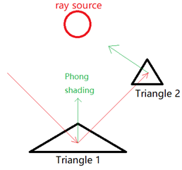

When use this strategy to render the image, I got the following image. The problem is that, it looks like every thing is a mirror that can have perfect reflection.

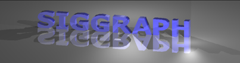

So, I use attenuation_reflection as a hyper parameter to decrease the reflection rate. Suppose the attenuation_reflection equal to 0.2, then the final color of the previous example will be [0, 255, 0] + [255, 0, 0] * 0.2 = [51, 255, 0]. And the rendering image is:

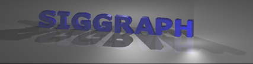

Also, a regular surface can not only have reflection, but also have diffuse scattering. When the ray intersect with triangle 1, I will randomly choose n_random_spread directions to launch rays, for each ray that intersect with another triangle, I will assume that triangle is a light source, and use Phong shading to calculate the color received by triangle 1. And also, it needs an attenuation_diffusion factor to decrease the diffuse scattering rate.

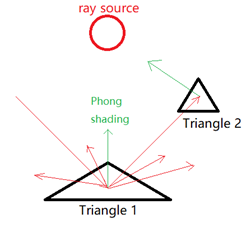

And the result looks almost the same as the original one. But with carefully checking, you may find the shadow below the blue letter is a little bit blue.

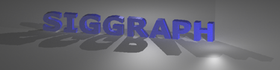

Another thing is that, since the reflection mainly affect the result, only the reflection ray can recursive, the diffuse scattering ray will not recursive. Which is LDS*E in regular expression. where LDS stands for light, diffuse reflectance, and specular reflectance, and E represents emissive light. The final ray path can be LDE, LDSE, LDSSE, LDSSSE, …. 

Finally, I set the maximum reflection equal to 2, and the two attenuation coefficients equal to 0.2, the result is:

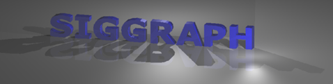

### 3. Super sampling anti-aliasing

This part is easy compared to other parts. It just needs to add an additional layer for super sampling. Previously, the process is:


Now, when use super sampling, the process is:

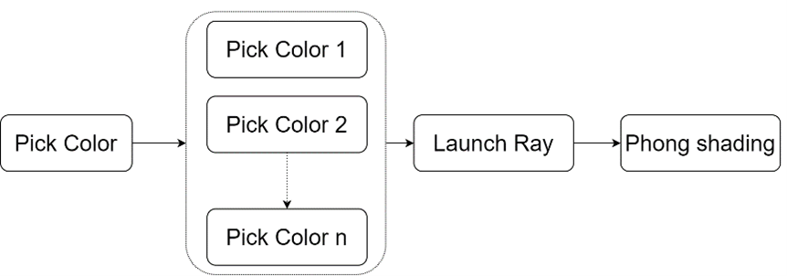

Here is the comparison of different scale of super sampling:

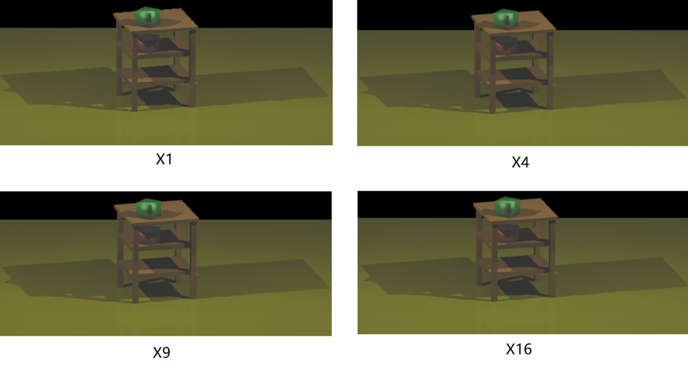

As the increasing of sampling point, the edge become more and more smooth.

### 4. Random problem and solutions of BRDF calculation.

Previously, I use rand()%1000 as the random function, but find that it is not “random” at all. Because I use multithread to do BRDF shading, each thread will need to call the random function. And when I set the number of random light sampling equal to 100, I got:

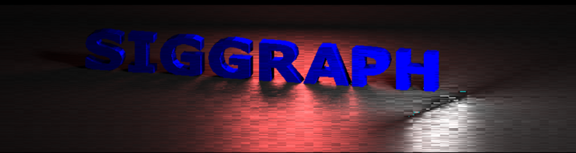

There are lots of “stripe” in the image. Because my laptop CPU has 16 thread, therefore, each time, 16 columns will be calculated in parallel, and it seems that all the 16 threads got related random value each time when they pick. For example, the random series of thread 1 got is 0.1, , 0.2, 0.3, 0.4, …, and the random series of thread 2 got is maybe 0.2, 0.3, 0.4, 0.5, …. 

I try to fix it by add srand(time(NULL)) in each thread, and I got:

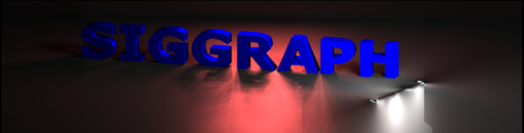

The result still looks weird, I can’t figure out why it looks like this, but I can only say that the random number is not “random”, but has relation.

Finally, I use the `std::mt19937_64 rng;  ` method that provided in the instruction page, and I got  

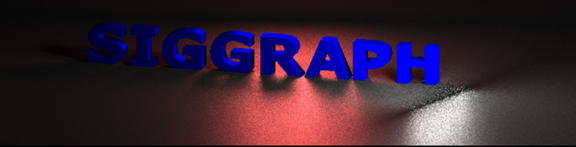

Although the noise is inevitable, the result looks more random. Then, I use a x16 super sampling, which means in each pixel, it will sampling 16 times, and for each time, it will sampling 100 random light.


There are still some noises. It seems that soft shadow is really difficult to achieve.

Finally, with reflection:


### 5. Construct BVH with SAH and multithread, and its optimization.

This is the reference code [link](https://www.pbr-book.org/3ed-2018/Primitives_and_Intersection_Acceleration/Bounding_Volume_Hierarchies#RadixSort). 

Intuitively, building BVH with any separation critical is not an embarrassingly parallel problem, which means that it is difficult to build BVH in parallel. But we can build the BVH by some other algorithms. So, here is the key idea of the algorithm:

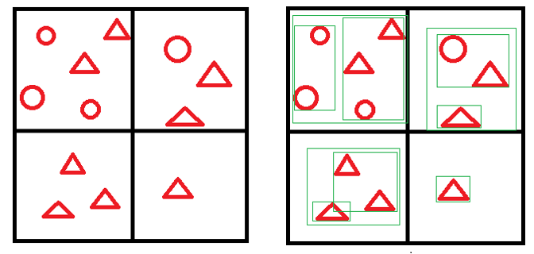

First, we can separate the whole space into many small grids, and classify each object (or say tile) into those small grids. We build BVH separately for each small grid, and call it subtree. In this algorithm, we will separate the space into 2^12 = 4096 small grids, and build 4096 subtrees in parallel. After that, we use surface area heuristic (short for SAH, an optimal solution in theory) as standard to combine those subtrees together to form one BVH tree.

Because the linked list tree is low efficiency in memory. So after that, we will need to “flatten” the linked list BVH tree into a vector data structure. In my experience, when using the linear tree structure, the total CPU time for intersection test is 20 to 30 percent less than the linked list tree structure. And then, remove the linked list tree to free the memory.

There are lots of details about the implementation of this algorithm, you can either check the [link](https://www.pbr-book.org/3ed-2018/Primitives_and_Intersection_Acceleration/Bounding_Volume_Hierarchies#RadixSort) or my code in BVH.cpp file for more information.